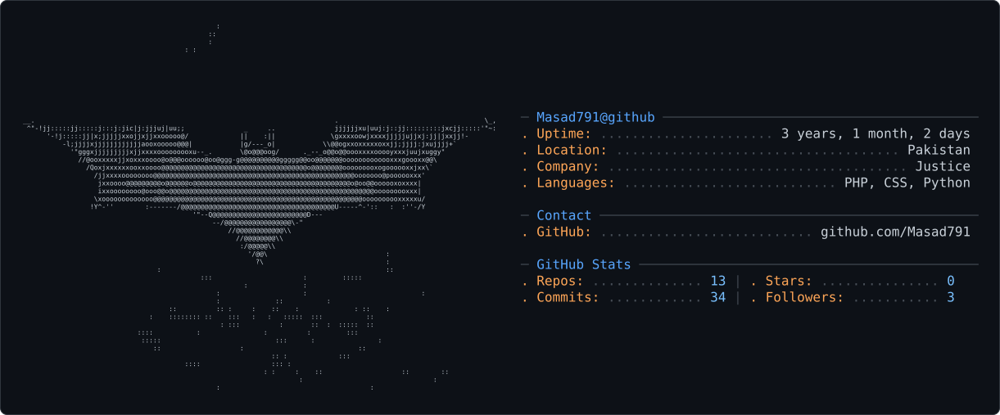

<picture>
  <source media="(prefers-color-scheme: dark)" srcset="dark_mode.svg" />
  <source media="(prefers-color-scheme: light)" srcset="light_mode.svg" />
  
</picture>


<h1 align="center">Hey, I'm Asad 👋</h1>
 
<p align="center">
  
</p>
 
### About Me
 
```php
<?php
 
class Asad
{
    public string $role     = 'Full Stack Web Developer';
    public string $location = 'Lahore, Pakistan 🇵🇰';
 
    public array $stack = [
        'backend'  => ['PHP', 'Laravel', 'REST API', 'Laravel Sanctum'],
        'database' => ['MySQL', 'PostgreSQL', 'Database Design', 'Redis'],
        'frontend' => ['Blade', 'TailwindCSS', 'Bootstrap', 'JavaScript'],
    ];
 
    public array $practices = [
        'SOLID Principles',
        'Clean Architecture',
        'Service · Repository · DTO Pattern',
        'nWidart Modular Architecture',
    ];
 
    public function currentlyLearning(): string
    {
        return 'Advanced System Design & PostgreSQL Internals';
    }
}
```
 
---
 
### Tech Stack
 
**Backend**
 


 
**Database**
 


 
**Frontend**
 


 
**Tools**
 


